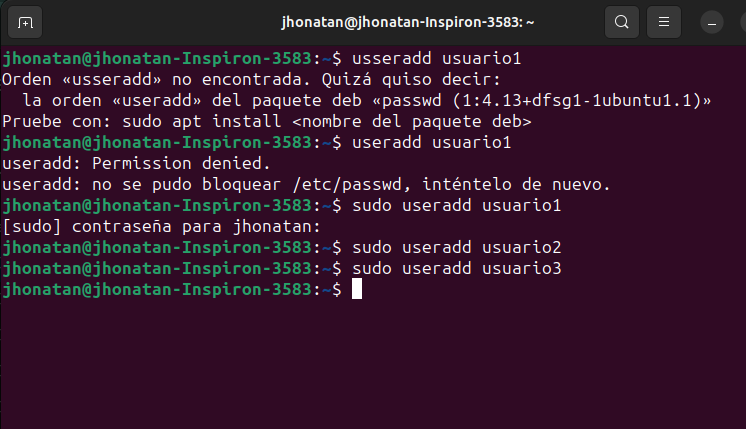
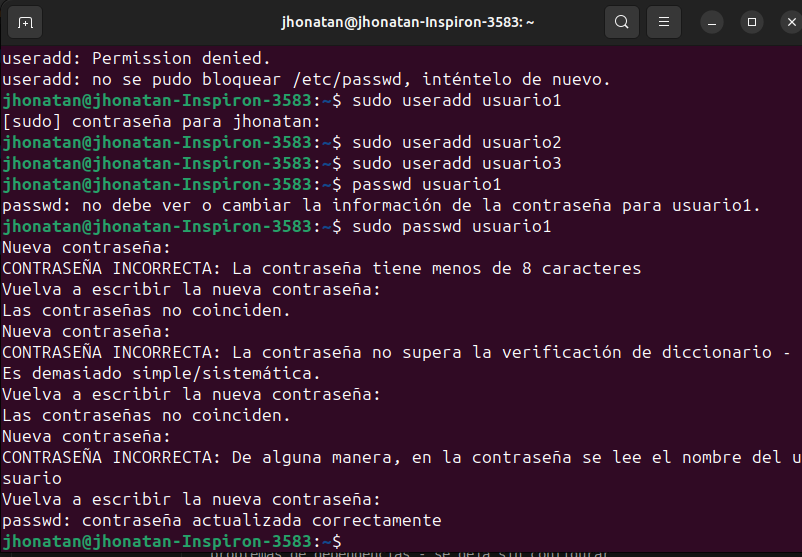
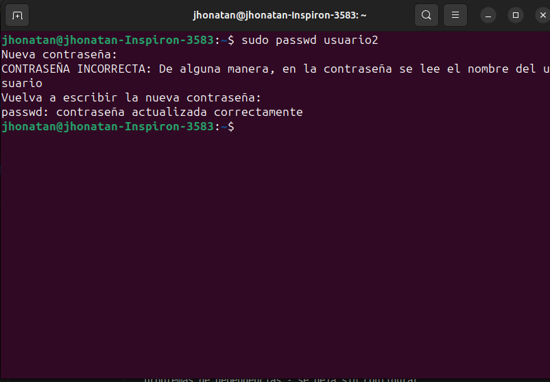
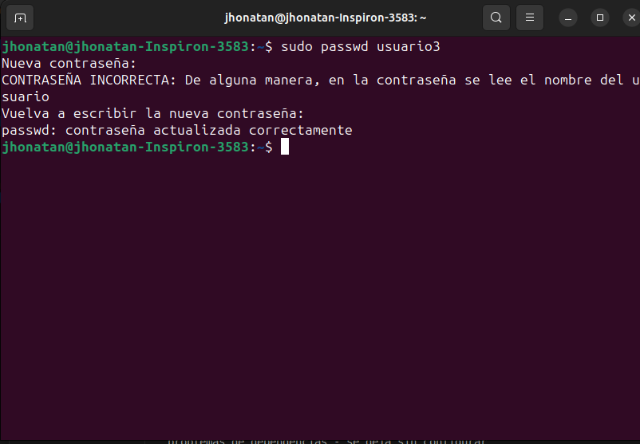
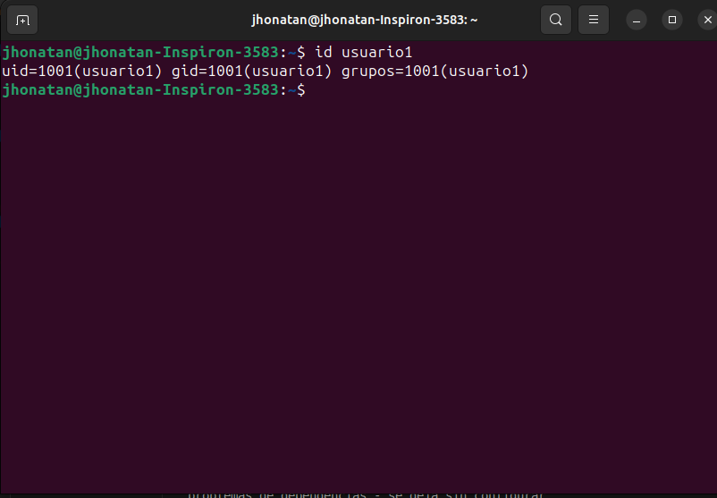
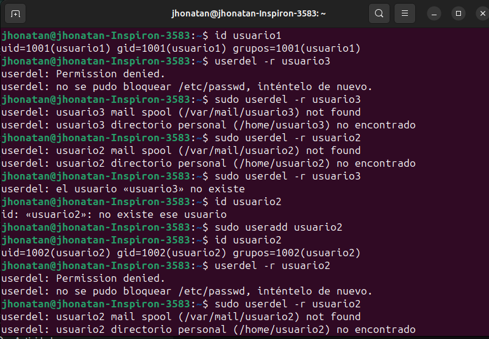
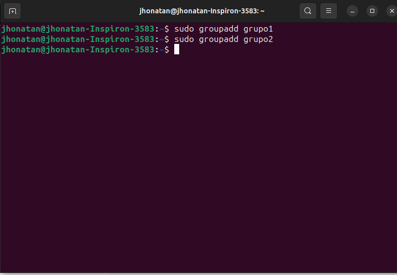
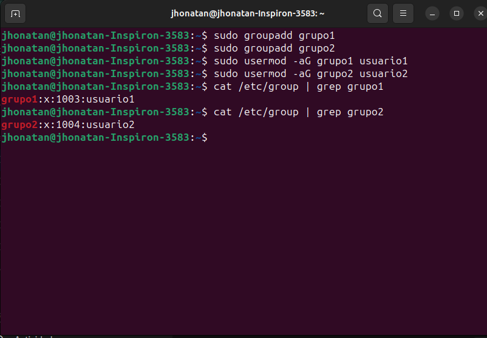
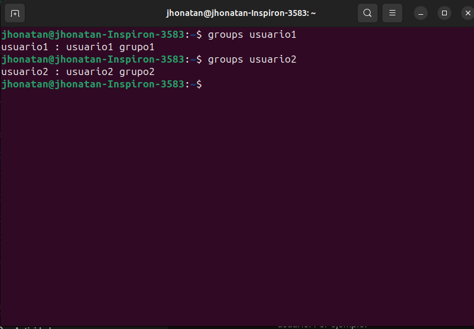
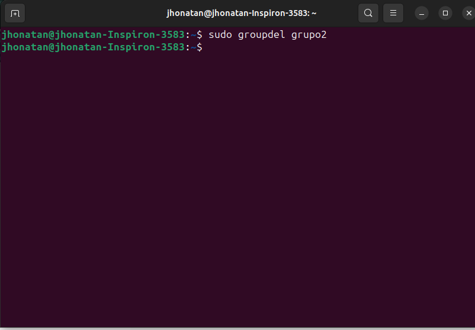

#   Gestion de Usuarios

1. Creacion de usuarios

2. Asignacion de contrasenas
- Para usuario 1

- Para usuario 2

- Para usuario 3

3. Informacion de usuario

4. Eliminacion de usuarios

# Gestion de grupos
1. Creacion de grupos

2. Agregar usuarios a grupos

3. Verificar membresia

4. Eliminar grupo

# Gestion de permisos
1. Creacion de archivos y directorios 

