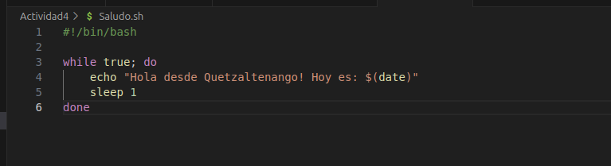
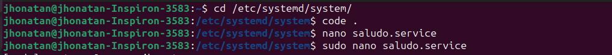
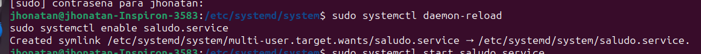
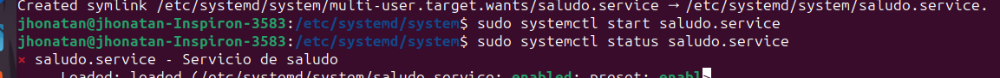

# Actividad 4

1. Crear el scrip
    
2. ir a la ruta /etc/systemd/system/

3. crear el archivo de configuracion 
    
4. habilitar el servicio
    
5. Iniciar el servicio

6. Para logs del servicio se utilizo: journalctl -u saludo.service
    